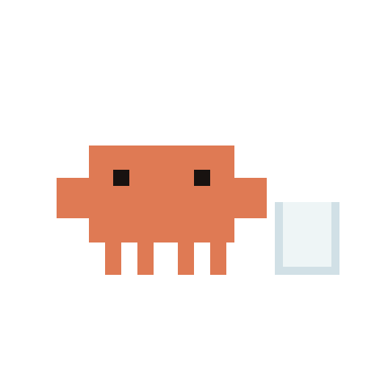
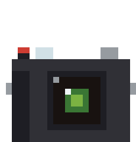

<h1>Hello I'm Cindy</h1>

<h3>Student @ Northeastern University</h3>

<i>Computer Vision</i> & Design
 
I'm extremely passionate about making matcha

<h3>Connect with me (˶˃ ᵕ ˂˶):</h3>

  
  

 

<h3>Currently exploring</h3>
The realm of Human-AI Interaction
 
Segmentation + zero-shot annotation models

 